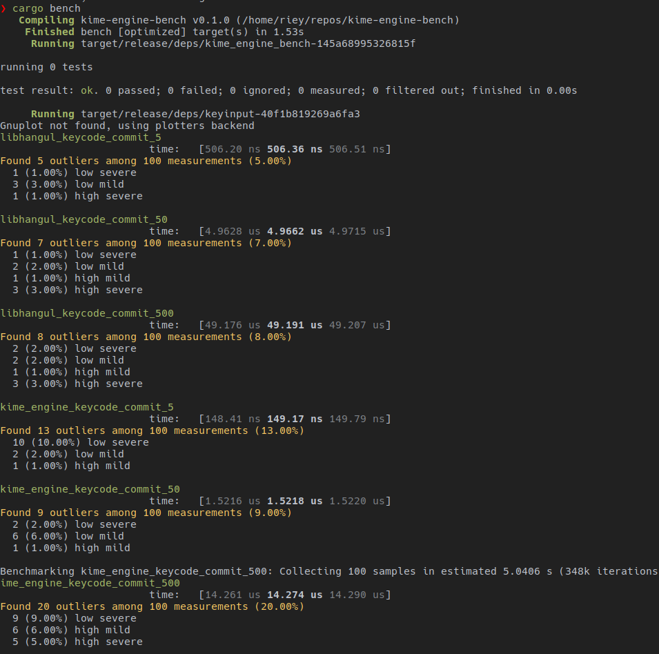

# kime-engine-bench

## Limitations

This bench is not quite pair because they both support korean input context but have different usage (i.e. `libhangul` doesn't support input `keycode` it only get `ascii`)

so this bench just reveal performance when those engines are used in `kime` project

## Result

